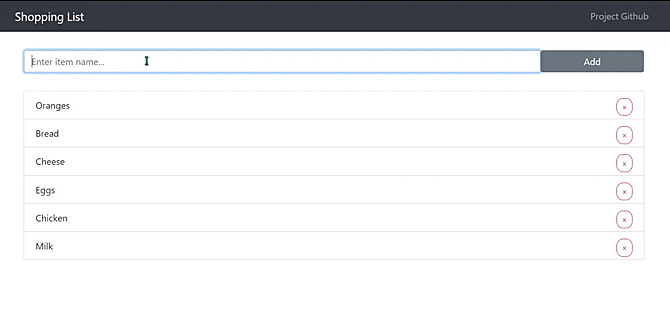

## Description
A full-stack simple wishlist application made with MERN.
- React and Redux in the front end.
- MongoDB as the database.
- Node and Express for the backend.

## Live version:
https://mernlistapp.herokuapp.com/

  

## How to get started:
#### Install server dependencies at root folder:
    npm i

#### Install dev dependencies at root:
    npm i -D

#### Install client dependencies at client folder:
    cd client
    npm install

#### To run the program in dev mode:
    npm run dev

#### To run client:
    npm run client

#### To run server:
    npm run server
